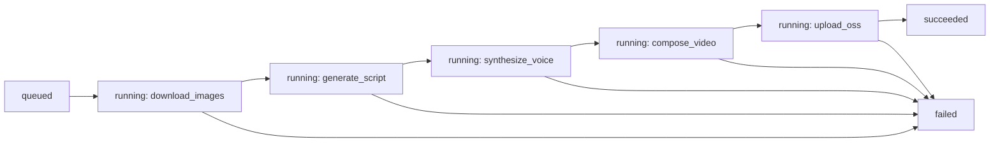

# 架构设计

Pixelle-Video 的技术架构概览。

---

## 核心架构

Pixelle-Video 采用分层架构设计：

- **Web 层**: Streamlit Web 界面
- **服务层**: 核心业务逻辑
- **ComfyUI 层**: 图像和TTS生成

---

## 主要组件

### PixelleVideoCore

核心服务类，协调各个子服务。

### LLM Service

负责调用大语言模型生成文案。

### Image Service

负责调用 ComfyUI 生成图像。

### TTS Service

负责调用 ComfyUI 生成语音。

### Video Generator

负责合成最终视频。

### Product Video Job Manager

商品短视频接口层，位于 `api/product_video_jobs.py` 和 `api/routers/product_videos.py`。

职责：

- 接收研发系统提交的商品信息、类目和主图 URL。
- 使用 `Idempotency-Key` 或 `request_id` 做幂等，避免重复生成。
- 优先读取结构化 `source_images`，兼容旧 `image_urls`，下载可用商品主图到运行目录。
- `source_images` 只允许商品主图参与生成，SKU 图、规格图、颜色图、详情图、评价图等非主图不计入可用主图数。
- 可用主图少于 `scene_count` 时直接失败，返回 `source_images_insufficient`，不复制图片补位。
- 调用火山方舟多模态模型生成分镜 JSON。
- 调用现有 Pixelle 商品资产视频合成脚本，生成 1:1 MP4。
- 启动时自动检测 CUDA/NVIDIA GPU；CUDA 与 `h264_nvenc` 可用时，ffmpeg 重编码使用 NVENC，默认 `PIXELLE_NVENC_PRESET=medium` 兼容 Ubuntu 20.04 的 ffmpeg 4.2。Chromium 帧渲染默认 CPU 稳定模式，只有显式设置 `PIXELLE_CHROMIUM_GPU=on` 时才尝试浏览器 GPU。
- 生成成功后上传 MP4 和分镜脚本到 OSS；未配置 OSS 时保留本地下载兜底。
- 把 job/item 状态持久化到 `PRODUCT_VIDEO_STATE_ROOT`。
- 通过鉴权接口返回状态、OSS 地址、本地调试下载地址、分镜脚本、选图信息和 token 用量。

### Product Video PIM Worker

批量生产时使用 `scripts/run_product_video_pim_worker.py` 主动对接 PIM：

- `GET /api/video-tool/get?type=1` 从 PIM 领取一个待生成任务。
- 将 PIM 返回的 `product.image_urls` 转成 `source_images[].image_type=main` 后传给本地 `/api/product-videos/jobs`。
- 本地生成成功后，向 PIM `POST /api/video-tool/submit` 回传 `status=2` 和 `video_url`。
- 本地生成失败后，向 PIM `POST /api/video-tool/submit` 回传 `status=3` 和 `error_msg`。
- PIM 队列为空时，worker 按 `PIM_EMPTY_QUEUE_SLEEP_SECONDS` 间隔重试。
- PIM 侧负责生成中任务超时重置，worker 不做心跳或续租。
- 当前默认 `PIM_WORKER_CONCURRENCY=4`，与本地 `PRODUCT_VIDEO_MAX_CONCURRENCY=4` 对齐；`PIM_WORKER_ONCE=1` 联调时强制单任务。

PIM 环境通过 `PIM_ENV=dev|stage|prod` 或 `PIM_BASE_URL` 指定。

状态流转：

---

## 技术栈

- **后端**: Python 3.10+, AsyncIO
- **Web**: Streamlit
- **AI**: OpenAI API, ComfyUI, 火山方舟多模态
- **配置**: YAML
- **工具**: uv (包管理)

---

## 更多信息

详细的架构文档即将推出。
