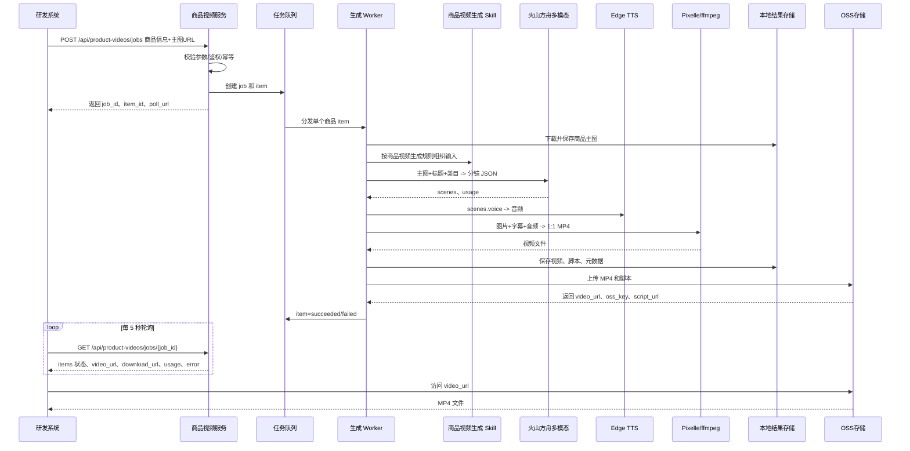
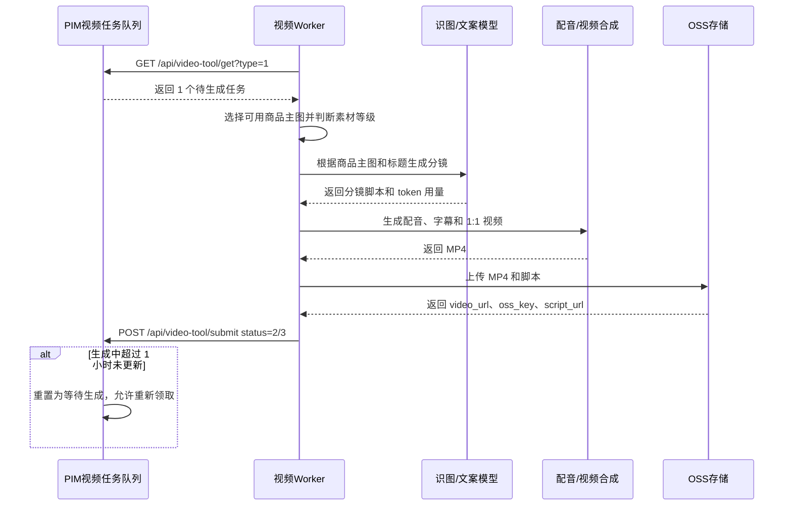
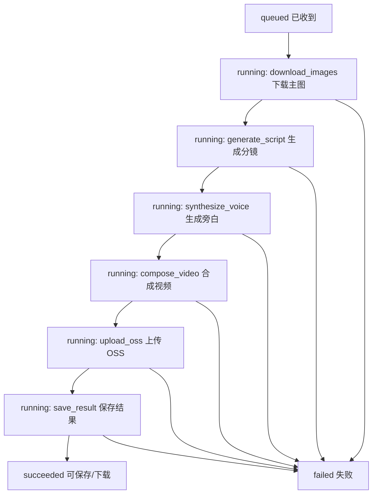

# 商品短视频生成服务对接说明

更新时间：2026-06-05

## 1. 一句话说明

研发把商品任务交给视频生成服务；视频服务自动生成 1:1 商品短视频，上传 OSS，并把成功结果或失败原因返回给研发系统。

小批量联调用当前已上线的任务接口；大批量生产用“PIM 现有视频任务队列 + 视频 worker 主动领取 + OSS 回传”的同一套产品流程。

## 2. 这次不做什么

- 不走网页操作台。
- 不再人工上传 Excel。
- 不需要产品或运营手动点“生成”。
- 不把火山方舟 API Key 暴露给研发系统。

## 3. 接入后是什么效果

### 3.1 接口联调流程

研发侧只需要做三件事：

1. 调用创建任务接口，把商品信息发给视频服务。
2. 每隔几秒调用查询接口，看视频是否生成完成。
3. 完成后保存 `video_url`，必要时用 `download_url` 做本地排障下载。

视频服务负责：

1. 接收商品标题、类目、商品 ID、主图链接。
2. 下载商品主图。
3. 识别主图并生成商品视频分镜。
4. 生成旁白、字幕和 1:1 视频。
5. 返回视频地址、脚本、时长、token 用量和失败原因。

### 3.2 批量生产流程

不建议研发一次性把一万个商品 POST 到视频服务。现在按 PIM 现有任务接口落地，视频 worker 主动领取并回传：

1. PIM 侧按创建计划产生待生成商品任务。
2. 视频 worker 调 PIM `GET /api/video-tool/get?type=1` 领取一个待处理商品。
3. PIM 把任务标记为生成中；worker 不需要额外心跳或锁。
4. worker 逐个商品生成视频。
5. worker 把 MP4 和脚本上传 OSS。
6. worker 调 PIM `POST /api/video-tool/submit` 回传 `status=2/3`、OSS 地址或失败原因。
7. 如果 worker 超过 1 小时未回传，PIM 侧定时把任务重置为等待生成，允许重新领取。

## 4. 部署口径

当前线上实例地址由部署环境决定。本地开发默认：

```text
http://localhost:8000/
```

1Panel / Docker 部署建议把 `30005` 作为纯后端 API 服务入口：

```text
外部访问：http://<server-ip>:30005/
容器内服务端口：8000
端口映射：30005:8000
监听地址：0.0.0.0
```

`/hlg` 只是 1Panel 面板入口，不是业务接口路径。研发系统直接请求业务服务根路径，例如 `http://<server-ip>:30005/`。

## 5. 核心接口

本章是当前已上线的联调接口，用于手动测试、排障、小样本验证和真实商品端到端检查。

### 5.1 创建视频任务

研发调用这个接口，把商品信息传给视频服务。

```http
POST /api/product-videos/jobs
Content-Type: application/json
Authorization: Bearer <INTERNAL_API_TOKEN>
Idempotency-Key: <业务唯一请求号>
```

幂等规则：

- 优先使用 Header `Idempotency-Key`。
- 如果没有 Header，则使用请求体里的 `request_id`。
- 同一个幂等键重复提交时，返回已有 `job_id`，不会重复创建一批生成任务。

请求示例：

```json
{
  "request_id": "req-20260602-0001",
  "source": "commerce-system",
  "options": {
    "aspect_ratio": "1:1",
    "target_duration_seconds": [14, 16],
    "scene_count": 5,
    "tts_speed": 1.08
  },
  "products": [
    {
      "external_product_id": "3814460745354183082",
      "title": "浅鹅黄假两件Polo衫",
      "category": "T恤/Polo衫",
      "source_images": [
        {"image_id": "img-001", "position": "main_1", "image_type": "main", "url": "https://example.com/main_1.jpg", "width": 1200, "height": 1200},
        {"image_id": "img-002", "position": "main_2", "image_type": "main", "url": "https://example.com/main_2.jpg", "width": 1200, "height": 1200},
        {"image_id": "img-003", "position": "main_3", "image_type": "main", "url": "https://example.com/main_3.jpg", "width": 1200, "height": 1200},
        {"image_id": "img-004", "position": "main_4", "image_type": "main", "url": "https://example.com/main_4.jpg", "width": 1200, "height": 1200},
        {"image_id": "img-005", "position": "main_5", "image_type": "main", "url": "https://example.com/main_5.jpg", "width": 1200, "height": 1200}
      ],
      "extra": {
        "shop": "欢乐逛"
      }
    }
  ]
}
```

成功返回：

```json
{
  "job_id": "job_20260602_153012_a8f1",
  "status": "queued",
  "created_at": "2026-06-02T15:30:12+08:00",
  "poll_url": "/api/product-videos/jobs/job_20260602_153012_a8f1",
  "items": [
    {
      "item_id": "item_20260602_153012_0001",
      "external_product_id": "3814460745354183082",
      "status": "queued"
    }
  ]
}
```

### 5.2 查询任务结果

研发用 `job_id` 轮询这个接口。

```http
GET /api/product-videos/jobs/{job_id}
Authorization: Bearer <INTERNAL_API_TOKEN>
```

返回示例：

```json
{
  "job_id": "job_20260602_153012_a8f1",
  "status": "running",
  "summary": {
    "total": 3,
    "queued": 1,
    "running": 1,
    "succeeded": 1,
    "failed": 0
  },
  "items": [
    {
      "item_id": "item_20260602_153012_0001",
      "external_product_id": "3814460745354183082",
      "title": "浅鹅黄假两件Polo衫",
      "status": "succeeded",
      "progress": 100,
      "video_url": "https://hlg-team.oss-cn-zhangjiakou.aliyuncs.com/ai批量生产视频/videos/2026/06/item_20260602_153012_0001.mp4?...",
      "script_url": "https://hlg-team.oss-cn-zhangjiakou.aliyuncs.com/ai批量生产视频/scripts/2026/06/item_20260602_153012_0001.json?...",
      "download_url": "/api/product-videos/items/item_20260602_153012_0001/video",
      "script_download_url": "/api/product-videos/items/item_20260602_153012_0001/script",
      "oss_key": "ai批量生产视频/videos/2026/06/item_20260602_153012_0001.mp4",
      "script_oss_key": "ai批量生产视频/scripts/2026/06/item_20260602_153012_0001.json",
      "material_level": "complete",
      "selected_images": [
        {"image_id": "img-001", "position": "main_1", "file": "main_1.png"}
      ],
      "duration_seconds": 15.18,
      "usage": {
        "model": "doubao-seed-2-0-lite-260215",
        "total_tokens": 1710
      },
      "error": null
    },
    {
      "item_id": "item_20260602_153012_0002",
      "external_product_id": "P002",
      "title": "猫抓板窝圆形耐磨不掉屑",
      "status": "running",
      "progress": 55,
      "stage": "compose_video",
      "video_url": null,
      "script_url": null,
      "duration_seconds": null,
      "usage": null,
      "error": null
    }
  ]
}
```

### 5.3 下载视频

单个商品生成完成后，研发优先使用 `video_url` 保存 OSS 地址；如果需要排障，可以调用 `download_url` 或下面的本地下载接口。

```http
GET /api/product-videos/items/{item_id}/video
Authorization: Bearer <INTERNAL_API_TOKEN>
```

成功时返回：

```http
HTTP/1.1 200 OK
Content-Type: video/mp4
Content-Disposition: attachment; filename="item_20260602_153012_0001.mp4"
```

### 5.4 下载分镜脚本

如果研发要看视频是怎么生成的，可以下载脚本。

```http
GET /api/product-videos/items/{item_id}/script
Authorization: Bearer <INTERNAL_API_TOKEN>
```

返回示例：

```json
{
  "visual_summary": "浅鹅黄色假两件上衣，白色翻领，胸前爱心图案。",
  "scenes": [
    {
      "image": "main_1.png",
      "subtitle": "浅鹅黄清爽显干净",
      "voice": "浅鹅黄清爽显干净",
      "duration": 2.8
    }
  ],
  "usage": {
    "model": "doubao-seed-2-0-lite-260215",
    "total_tokens": 1710
  }
}
```

## 6. 研发需要提供哪些商品信息

| 字段 | 必填 | 说明 |
| --- | --- | --- |
| `external_product_id` | 是 | 研发侧商品唯一 ID |
| `title` | 是 | 商品标题 |
| `category` | 否 | 商品类目，建议提供，能提高文案准确性 |
| `source_images` | 否 | 结构化商品主图，优先使用；包含 image_id、position、image_type、url、width、height 等 |
| `image_urls` | 否 | 兼容旧格式的商品主图 URL；没有 source_images 时使用 |
| `extra` | 否 | 透传字段，例如店铺、来源、批次 |

图片要求：

- 图片 URL 必须能被视频服务器直接访问。
- 不要传本机路径。
- 不要传需要登录后才能访问的图片地址，除非双方额外约定鉴权方式。
- 只传商品主图。SKU 图、规格图、颜色图、详情图、评价图、买家秀图等非主图不参与生成。
- `source_images[].image_type` 建议固定传 `main`，`position` 建议传 `main_1`、`main_2` 等主图位置。
- 默认 `scene_count=5` 时，需要 5 张可用主图；主图不足时失败，不复制图片补位。

如果研发侧已有更完整的图片结构，建议直接传 `source_images`，并包含 `image_id`、`position`、`image_type`、`width`、`height`、`platform_name`、`project_id`、`shop_id` 等字段。

## 7. 主图数量兜底

商品视频不能假设每个商品固定有 5 张主图，但当前生成质量口径是不复制图片补位。只有商品主图计入可用主图数，可用主图少于 `scene_count` 时，该商品失败并回传原因。

| 可用主图数 | 处理方式 | 结果口径 |
| --- | --- | --- |
| 0 张 | 不生成视频 | 商品失败，回传 `source_images_unusable` |
| 1-4 张 | 不生成视频 | 商品失败，回传 `source_images_insufficient` |
| 5 张及以上 | 正常生成 | 最多选择 `scene_count` 张商品主图 |

图片选择要保留原始 `imageId`、`position`、`source`、`width`、`height` 等信息，方便研发知道视频使用了哪些主图。

如果上游已经完成图片去水印或去品牌风险处理，视频服务优先使用最终可发布图；如果没有最终图，再使用原图。

## 8. PIM Worker 模式

### 8.1 目标流程

```text
视频 worker -> PIM：GET /api/video-tool/get?type=1
PIM -> 视频 worker：返回一个待生成商品任务
视频 worker -> OSS：上传 MP4 和脚本
视频 worker -> PIM：POST /api/video-tool/submit 回传 status=2/3
```

### 8.2 PIM 环境地址

| 环境 | 地址 |
| --- | --- |
| dev | `https://gdpim-dev.huanleguang.com` |
| stage | `https://gdpim-stage.huanleguang.com` |
| prod | `https://gdpim.huanleguang.com` |

### 8.3 PIM 已提供接口

| 接口 | 用途 |
| --- | --- |
| `GET /api/video-tool/get?type=1` | 取一个待生成任务；`type=1` 表示 AI 生成视频 |
| `POST /api/video-tool/submit` | 上报生成结果 |

### 8.4 获取任务成功响应

```json
{
  "id": 1001,
  "platform_id": 6,
  "shop_id": 456,
  "item_id": "88888888",
  "config_data": {},
  "product": {
    "external_product_id": "3814460745354183082",
    "title": "浅鹅黄假两件Polo衫",
    "category": "T恤/Polo衫",
    "image_urls": [
      "https://example.com/main_1.jpg",
      "https://example.com/main_2.jpg"
    ]
  },
  "_generate_item_id": 999,
  "_group_id": 123,
  "_plan_id": 789
}
```

字段口径：

| 字段 | 说明 |
| --- | --- |
| `id` | 上报时必须原样带回 |
| `config_data` | 创建计划时前端传入的生成配置，worker 自行解析 |
| `product.external_product_id` | 平台外部商品 ID |
| `product.title` | 商品标题 |
| `product.category` | 叶子品类名称 |
| `product.image_urls` | 全量主图列表，至少 1 张；worker 会按商品主图转成 `source_images[].image_type=main` 后生成 |
| `_*` 前缀字段 | PIM 内部路由字段，worker 忽略即可 |

队列为空时，PIM 返回：

```json
{ "code": 500, "message": "没有需要生成的任务" }
```

worker 收到该响应后按配置间隔重试，不上报失败。

### 8.5 上报结果

成功时：

```json
{
  "id": 1001,
  "status": 2,
  "video_url": "https://...oss.../generated.mp4",
  "error_msg": ""
}
```

失败时：

```json
{
  "id": 1001,
  "status": 3,
  "video_url": "",
  "error_msg": "主图数量不足：生成视频需要 5 张可用主图，当前只有 3 张。请补充商品主图后重试。"
}
```

PIM 侧处理：

- `status=2`：写入视频地址，自动扣除 1 点，类型 77。
- `status=3`：记录失败原因，可由用户手动重试。
- `error_msg` 会给客户看，必须是中文短句；英文错误码、Python 堆栈、服务器路径只允许留在 worker 日志里。
- PIM 每 30 分钟自动将生成中超过 1 小时未更新的任务重置为等待生成；worker 不需要做心跳或续租。

## 9. OSS 结果口径

正式生产建议直接走 OSS：

- 生成成功后，worker 先上传 MP4 到 OSS。
- 如果研发需要分镜脚本，也上传 JSON 脚本到 OSS。
- 研发侧保存 `video_url`、`oss_key`、`script_url`、`script_oss_key`、`duration_seconds`。
- 当前轮询接口中 `video_url` / `script_url` 优先返回 OSS 地址；`download_url` / `script_download_url` 保留服务本地调试下载地址。
- 本地下载接口可以保留为调试和兼容能力，但正式链路以 OSS 地址为准。
- OSS 凭据只放在视频服务运行环境，不写入仓库、日志和对接文档。

OSS 存储口径：

| 项目 | 当前值 |
| --- | --- |
| 云服务 | 阿里云 OSS |
| 区域 | 张家口 |
| Bucket | `hlg-team` |
| 外网 Endpoint | `oss-cn-zhangjiakou.aliyuncs.com` |
| 内网 Endpoint | `oss-cn-zhangjiakou-internal.aliyuncs.com` |
| Bucket 域名 | `hlg-team.oss-cn-zhangjiakou.aliyuncs.com` |
| CNAME 域名 | `hlg-team.cn-zhangjiakou.taihangpfm.cn` |
| 项目前缀 | `ai批量生产视频/` |
| URL 方式 | 当前返回签名 URL，研发保存 `oss_key` 作为长期定位字段 |

对象路径规则：

```text
视频 MP4：ai批量生产视频/videos/{yyyy}/{mm}/{item_id}.mp4
分镜脚本：ai批量生产视频/scripts/{yyyy}/{mm}/{item_id}.json
预览图，如后续需要：ai批量生产视频/previews/{yyyy}/{mm}/{item_id}.jpg
```

示例：

```text
oss_key=ai批量生产视频/videos/2026/06/item_20260605_181922_0001_35a334.mp4
video_url=https://hlg-team.oss-cn-zhangjiakou.aliyuncs.com/ai批量生产视频/videos/2026/06/item_20260605_181922_0001_35a334.mp4?...
```

注意：`OSS_ACCESS_KEY_ID` 和 `OSS_ACCESS_KEY_SECRET` 只放服务器 `.env`，产品文档只写变量名和存储口径，不写真实值。

## 10. 大批量和并发口径

一万个商品不应该作为一个超大请求进入视频服务，而应该是一万个独立 item：

- PIM 现有视频任务队列负责保存等待生成、生成中、成功、失败等状态。
- 当前线上 PIM worker 单机按 15 并发跑：`PIM_WORKER_CONCURRENCY=15` 控制 worker 同时领取和处理任务数；2026-06-10 已验证单机 30 并发会让 CPU/ffmpeg 合成阶段打满并触发 240 秒超时。手工 API 生成并发仍保持 `PRODUCT_VIDEO_MAX_CONCURRENCY=4`。
- 多台服务器可以同时跑多个 worker，共同从 PIM 领取任务。
- PIM 负责生成中状态和超时重置；worker 不做心跳或续租。
- PIM worker 直接完成下载主图、调用方舟、合成 MP4、上传 OSS、回传 PIM，不依赖本地 `/api/product-videos` API 服务。
- 单个商品失败不影响其它商品继续生成。
- 任务超时未回传时，PIM 自动释放，允许重新领取。

GPU 口径：

- 服务启动时自动检测 CUDA/NVIDIA 显卡。
- 如果运行环境能看到 CUDA 且 ffmpeg 支持 `h264_nvenc`，视频重编码使用 NVENC；否则自动走 CPU `libx264`。
- NVENC 默认 preset 是 `medium`，兼容 Ubuntu 20.04 ffmpeg 4.2；不要默认写死新版 ffmpeg 的 `p4`。
- Chromium 帧渲染默认使用 CPU 稳定模式；只有显式设置 `PIXELLE_CHROMIUM_GPU=on` 时才尝试浏览器 GPU。

## 11. 状态说明

| 状态 | 说明 |
| --- | --- |
| `queued` | 已收到，排队中 |
| `running` | 正在生成 |
| `succeeded` | 生成完成，可保存 OSS 地址或下载调试文件 |
| `failed` | 生成失败 |
| `canceled` | 已取消 |

生成阶段：

| 阶段 | 说明 |
| --- | --- |
| `download_images` | 下载商品主图 |
| `generate_script` | 识图并生成分镜 |
| `synthesize_voice` | 生成旁白 |
| `compose_video` | 合成 1:1 视频 |
| `upload_oss` | 上传 MP4 和脚本到 OSS，未配置 OSS 时跳过并保留本地下载 |
| `save_result` | 保存结果 |

PIM Worker 模式建议补充：

| 状态 | 说明 |
| --- | --- |
| `pending` | PIM 视频任务队列待领取 |
| `processing` | 已被 worker 领取，PIM 标记为生成中 |
| `skipped` | 不满足生成条件，例如没有可用主图 |

## 12. 轮询建议

- 创建任务后等 3 秒再开始轮询。
- 每 5 秒查一次任务状态。
- 单个任务最长等待 30 分钟。
- 一个批次里某个商品先完成，就可以先下载，不必等整个批次结束。
- 如果接口返回 `429`，按返回的 `retry_after_seconds` 延后查询。

PIM Worker 模式下，研发侧不需要轮询我们的视频服务；worker 会主动领取任务并回传结果。产品或研发要看整体进度时，应查询 PIM 侧任务列表。

## 13. 对接流程图

### 13.1 接口联调流程



### 13.2 任务池生产流程



### 13.3 单个商品状态流转



## 14. 安全和权限

- 研发只拿 `INTERNAL_API_TOKEN`。
- 火山方舟 `ARK_API_KEY` 只放在视频服务环境变量里。
- 视频下载接口也要鉴权，不能把结果目录裸露到公网。
- 日志里可以记录商品 ID、任务 ID、token 用量、耗时，不记录密钥、图片 base64、完整 prompt。
- OSS access key、secret、bucket 写入运行环境，不写入仓库和文档。

## 15. 产品验收标准

产品侧先看这几条是否认可：

1. 商品信息由研发直接传给视频服务。
2. 视频服务按商品一个个生成视频。
3. 小批量联调时研发用 `job_id` 轮询状态；批量生产时由 worker 主动领取任务并回传结果。
4. 商品完成后 `video_url` 优先返回 OSS 地址，`download_url` 保留本地调试下载。
5. 视频规格固定为 1:1。
6. 默认目标时长为 14-16 秒。
7. 一个商品失败不影响同批次其他商品继续生成。
8. 返回结果里能看到失败原因、视频时长和 token 用量。
9. 可用主图不足 `scene_count` 时不生成，不复制图片补位，回传中文失败原因。
10. 一万个商品按 item 分片处理，不走单个超大请求。

## 16. 当前开发状态

已有测试能力：

- 已能通过商品图片生成分镜。
- 已能生成 1:1 商品短视频。
- 已有单商品和 Excel 批量测试逻辑。
- 已有 1Panel 测试入口 `30005`。

已经补上正式接口：

- `POST /api/product-videos/jobs`
- `GET /api/product-videos/jobs/{job_id}`
- `GET /api/product-videos/items/{item_id}/video`
- `GET /api/product-videos/items/{item_id}/script`
- 后台任务队列和状态持久化。
- 视频下载鉴权。
- OSS 上传和结果地址返回。
- 图片选择和主图数量失败口径。

代码仓库和版本管理：

- GitHub 仓库：`https://github.com/caomei242/piliangshengchengshipin`
- SSH 地址：`git@github.com:caomei242/piliangshengchengshipin.git`
- 默认分支：`main`
- 2026-06-09 已推送当前代码树作为远端干净初始提交；原 Pixelle 上游只作为本地 `upstream` 对比来源。
- 日常改动按 `git add`、`git commit`、`git push` 管理；提交前必须确认 `.env`、真实 Ark/OSS 密钥、1Panel 密码和内部 token 没有进入 Git。

后续待技术评审和开发：

- 将 PIM worker 在目标环境启用：`GET /api/video-tool/get?type=1` 领取任务，`POST /api/video-tool/submit` 回传结果。
- 确认 PIM 接口鉴权方式和 dev/stage/prod 环境切换方式。
- 压测 15 并发领取和生成、空队列重试频率、失败上报和 PIM 超时重置；更大吞吐通过多台 worker 扩容，不在单机继续硬拉并发。

1Panel 正式接口版 compose：

```text
docker-compose.product-api.yml
```

当前线上部署状态：

- 容器名：`pixelle-video-product-api`
- 镜像：`pixelle-video-product-api:20260602`
- 平台：`linux/amd64`
- 端口映射：`30005:8000`
- 容器状态：`healthy`
- `GET /health` 已验收返回 `200`
- 未带 token 调业务接口已验收返回 `401`
- 带 token 查询不存在任务已验收返回 `404`
- 带 token 调创建任务接口、但商品列表为空，已验收返回参数错误 `422`，说明创建接口在线且校验生效
- 2026-06-05 线上少图冒烟已验收：3 张可用主图、`scene_count=5` 时返回 `source_images_insufficient`
- 2026-06-05 线上 5 图 OSS 冒烟已验收：生成成功，成片 `15.71s`，OSS 视频、OSS 脚本、本地视频、本地脚本均返回 `200`
- 2026-06-05 线上主图过滤冒烟已验收：1 张 `main`、1 张 `sku`、1 张 `detail`、`scene_count=3` 时，只使用 `main` 图，任务失败并返回 `source_images_insufficient: need 3 usable main images, got 1, submitted 3, skipped_non_main 2`
- 2026-06-05 线上 3 主图成功冒烟已验收：3 张 `main`、`scene_count=3` 时生成成功，成片 `11.58s`，OSS 视频 key 为 `ai批量生产视频/videos/2026/06/item_20260605_185819_0001_e213b3.mp4`，脚本 key 为 `ai批量生产视频/scripts/2026/06/item_20260605_185819_0001_e213b3.json`
- 2026-06-08 GPU/PM2 机器 `172.16.2.203` 已验收：`GET /health=200`，系统 ffmpeg 支持 `h264_nvenc`，`PIXELLE_FFMPEG_ENCODER=auto` + `PIXELLE_NVENC_PRESET=medium` 端到端生成成功并上传 OSS，测试 job 为 `job_20260608_120206_2bcf728b`。
- 2026-06-08 浏览器渲染口径已调整：`PIXELLE_CHROMIUM_GPU=off` 为默认稳定模式，避免 Chromium 先尝试 GPU 截图失败再兜底。

本地仓库不保存真实 API key 或内部 token。线上部署时通过服务器 `.env` 提供：

```text
ARK_API_KEY=<server-side secret>
INTERNAL_API_TOKEN=<server-side internal token>
OSS_ACCESS_KEY_ID=<server-side secret>
OSS_ACCESS_KEY_SECRET=<server-side secret>
OSS_BUCKET=hlg-team
OSS_ENDPOINT=oss-cn-zhangjiakou.aliyuncs.com
OSS_PREFIX=ai批量生产视频/
PRODUCT_VIDEO_MAX_CONCURRENCY=4
PIXELLE_USE_CUDA=auto
PIXELLE_FFMPEG_ENCODER=auto
PIXELLE_NVENC_PRESET=medium
PIXELLE_CHROMIUM_GPU=off
```
